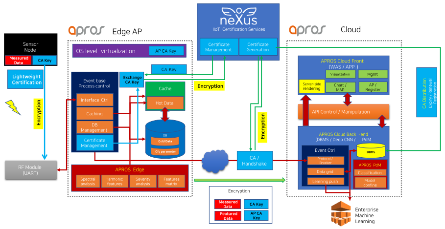

# Need for Secure IoT in IIoT PdM Application

With the introduction of Industry 4.0, we are exploring the use of various predictive maintenance solutions that integrate IoT technology as a way to maintain equipment in a variety of industries. Methods for maintenance of industrial facilities in industrial facilities can be classified as Run-to-failure, Preventive maintenance, and Predictive maintenance. In modern times, the run-to-failure method is costly due to the interruption of production facilities. Accordingly, the average operation time is calculated by the method of preventive maintenance, and the equipment is replaced or diagnosed before the failure occurs.

But further, PdM solutions are condition-based preventive maintenance programs. Instead of relying on industry or in-plant average life expectancy statistics (i.e., mean-time-to-failure) to plan maintenance activities, PdM solutions can be used to direct monitoring of the mechanical conditions, system efficiency and other indicators (failure time or efficiency loss) to determine the actual remaining useful life expectancy. PdM solutions are based on scientific and data, unlike maintenance managers' intuition and maintenance based on personal experience. Recently, hardware performance and AI technology are rapidly emerging, and PdM technology applying this technology is rapidly emerging as a technology for accurately diagnosing the state of the industrial facilities and predicting the state of machines.

As a result, APROS is developing PdM solutions based on vibration and current sensors, which can be applied not only to newly installed industrial facilities but also to existing industrial facilities. APROS developed and demonstrated IIoT PdM solution with SK Telecom to develop Predictive maitenance technique of these industrial facilities. In addition, APROS develops advanced PdM solution along with KETI, and develops communication with IIoT devices and Edge Computing to solve the various problems that occur simultaneously with the distribution of computing resources and the operation of test bed. Among these problems, especially large business sites tend to build IIoT systems in their internal networks due to security problems, while SMEs and small factories tend to prefer to maintain as a cloud system in terms of economics such as initial cost burden. This gap could arise from the absence of reliable security, and a security solution for IIoT devices and cloud platforms is required in cooperation with certification authorities as a way to overcome this gap.

Figure~\ref{fig:apros-pdm-with-ca} shows the edge computing AP and Cloud platform being developed by APROS.

## Specification of IIoT Devices developed by APROS

APROS developed IIoT devices such as vibration sensor, current sensor, etc. Specifications of the smart sensor node and the smart gateway are as following Table~\ref{tab:smartsensor} and Table~\ref{tab:smartgateway}.

|Vibration sensor|Current sensor|
|---|---|
MCU|CC1310, CoreTex - M3 Process|CC1310|
Flash| 128kB| 128kB|
RAM| 20kB| 20kB|
Firmware| 48kB| 48kB|
Radio Frequency| 900MHz| 900MHz|
Comm. protocol | IEEE 802.15.4g(SUN)| IEEE 802.15.4g(SUN)|
Power Consumption| avg. 406$\mu$A @3.3V |avg. 100$\mu$A @3.3V|
Life-time | 3 yrs.| Self-powered|

|Embedded module| Artic 701S|
|---|---|
|CPU | Coretex - A53 @1.4GHz|
|Flash | 4GB eMMC v4.5|
|RAM | 1G DDR3|
|Middleware size | 355kB + 1GB(Edge S/W)|
|Radio Frequency | 900MHz, 4CH|
|Comm. protocol | IEEE 802.15.4g(SUN), Ethernet|
|Life-time | Power supplied (PoE)|

## Test bed for Secure IIoT solution development

APROS installed vibration sensor in SK Hynix factory utility room in cooperation with SK Telecom and built on-premise to operate in internal server due to security problem. The problem is that an engineer has to visit the site to check the operation status of the existing IIoT devices and confirm it as an internal network. It is also difficult to confirm whether the learning process for PdM through the featured data obtained through the edge computing of the AP is normally performed.

To solve this problem, APROS develops Edge computing technology and Secure IIoT technology by installing sensor node and AP in KETI test bed. Figure~\ref{fig:apros-pdm-test-bed} shows that APROS IIoT PdM solution installed on the test bed.

# Requirements for Secure IoT Deivces and Cloud Platforms

Even though the IIoT PdM Solution is working on-premise, IIoT devices using communication modules can easily be exposed to the outside environment. Therefore, both on-premise and cloud solutions require secure IIoT solution.

IIoT devices are classified into sensor nodes, access points or gateways. All of these devices require a lightweight certificate and authentication server for security.

## Sensor Node

Due to the limited memory capacity and data transmission rate of the communication module, the sensor node is required to have a lightweight certificate. In addition, bi-directional communication on-air programming (OTA) is required to discard expired certificates and mount updated certificates.

## Gateway (AP)

Since the AP is the gateway for collecting data from the sensor node and sending it to the server, a certificate is also required from the gateway device. Since the memory capacity and the data transmission rate are relatively less restrictive than the sensor node, the existing authentication method can be applied. However, since the data that has been authenticated by the sensor node must be regarded as reliable data, an application for authentication is separately required.
