# A-PdM Core : Prognosis (RUL Estimation)

## v1.1.0 (2019-08-20)

- 데이터 처리, 프리프로세싱 완료
- RUL 추정 완료: 오래된 챌린지 데이터셋이라서 개발한 알고리즘의 성능평가는 큰 의미가 없음
- python 모듈로 작업 후 컨테이너로 core 탑재 예정

## 유사성 기반 RUL 추정기법 (Similarity-Based Remaining Useful Life Estimation)

- 전처리
- Trending Features의 선택
- 센서 퓨전에 의한 상태 지표 표출
- 유사성 RUL 추정기 학습
- 사전 예지 분석 성능의 유효성 확인
  
### Data Preparation [DATASET](dataset.md)

- PHM2008 학회 데이터 첼린지 데이터셋을 사용 [https://ti.arc.nasa.gov/tech/dash/groups/pcoe/prognostic-data-repository/](https://ti.arc.nasa.gov/tech/dash/groups/pcoe/prognostic-data-repository/)
- 218개의 Run-to-failure의 데이터가 있음 (앙상블 데이터: 다변수 시계열 데이터)
- 각 시계열 데이터는 각각 다른 엔진에서 계측한 것이지만, 동일 기종의 엔진으로 구성
- 각 엔진은 알려지지 않은 초기 마모 및 제조 편자가 있음 -> 결함 조건은 아님
- 각각의 앙상블마다 26개의 컬럼의 데이터가 있음

| column | contents               |
| ------ | ---------------------- |
| 1      | unit number            |
| 2      | time, in cycles        |
| 3      | operational setting 1  |
| 4      | operational setting 2  |
| 5      | operational setting 3  |
| 6      | sensor measurement  1  |
| 7      | sensor measurement  2  |
| ...    | ...                    |
| 26     | sensor measurement  26 |

- 엔진 성능에 상당한 영향을 주는 세가지의 작동 설정이 있고 이러한 설정이 데이터에 포함되어 있음
- 엔진은 데이터 초기 시작부분에서는 정상적으로 작동하고 일부 지점에서 성능이 저하되기 시작하여 엔진 가동하기 적절하지 않은 상태까지의 데이터를 포함함

### Processing

- 성능평가를 위해 학습데이터 셋과 유효성 검증 데이터로 분리 함
- 관심 변수 그룹을 지정
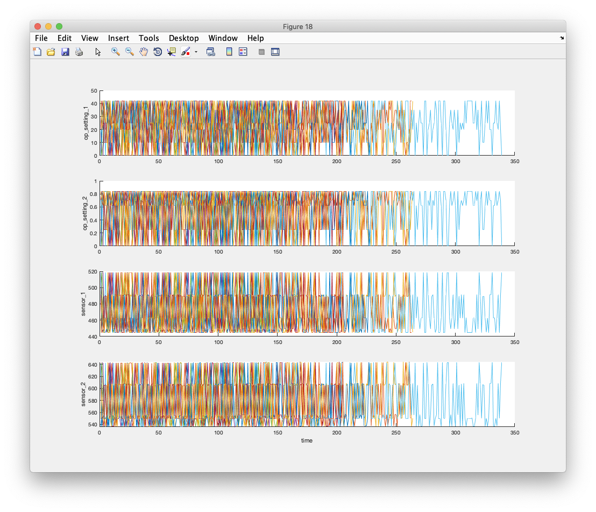

### 작업 영역 클러스터링 (Working Regime Clustering)

- 각각의 run-to-failure 측정에서 저하 과정을 보여주는 분명한 경향이 없음
- 센서 신호에서보다 명확한 성능 저하 추세를 추출하기 위해 작동 조건을 사용
- `op_setting_1`, `op_setting_2` 및 `op_setting_3`의 세 가지 작동 조건을 포함
- 각 셀에서 테이블을 추출하여 단일 테이블로 연결
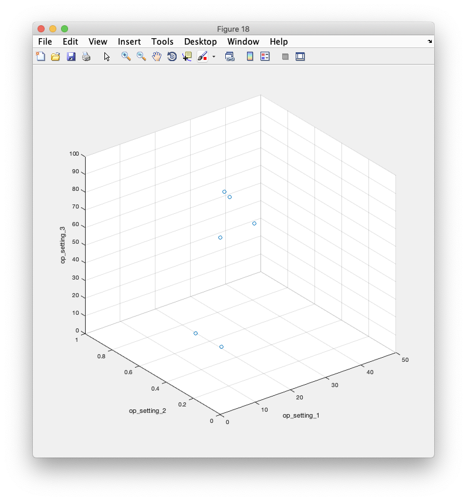
- 클러스터링 기술을 사용하여 6개의 클러스터를 자동으로 찾음 (K-means 알고리즘)
- K-means는 가장 널리 사용되는 클러스터링 알고리즘 중 하나이지만 결과는 로컬 최적화에만 유용함
-  K-means 클러스터링 알고리즘을 다른 초기 조건으로 여러 번 반복하고 가장 낮은 성능지수로 결과를 선택
- 5번 실행
```
[clusterIndex, centers] = kmeans(table2array(opConditionUnwrap), 6, ...
    'Distance', 'sqeuclidean', 'Replicates', 5, 'Options', opts);
```
- 결과는 동일
```
Replicate 1, 1 iterations, total sum of distances = 0.279547.
Replicate 2, 1 iterations, total sum of distances = 0.279547.
Replicate 3, 1 iterations, total sum of distances = 0.279547.
Replicate 4, 1 iterations, total sum of distances = 0.279547.
Replicate 5, 1 iterations, total sum of distances = 0.279547.
Best total sum of distances = 0.279547
```

### 작업 영역 정규화 (Working Regime Normalization)

- 다양한 작업 영역별로 그룹화 된 측정치에 대한 정규화를 수행
- 작업 영역별로 클러스터링된 각 센서 계측값의 평균 및 표준 편차를 계산
- 각 영역의 통계는 학습 자료를 정규화하는데 사용
- 각 앙상블 멤버에 대해 각 행의 동작 포인트를 추출하고 각 클러스터 센터까지의 거리를 계산하고 가장 가까운 클러스터 센터를 찾음
- 그 후 각 센서 측정에 대해 평균을 빼고 해당 클러스터의 표준 편차로 나눔
- 표준 편차가 0에 가까우면 정규화된 센서 계측값이 0에 가깝고, 거의 동일한 센서 측정이 RUL 예측을 위해 유용하지 않으니 예외처리
- 작업 영역의 데이터 정규화 시각화
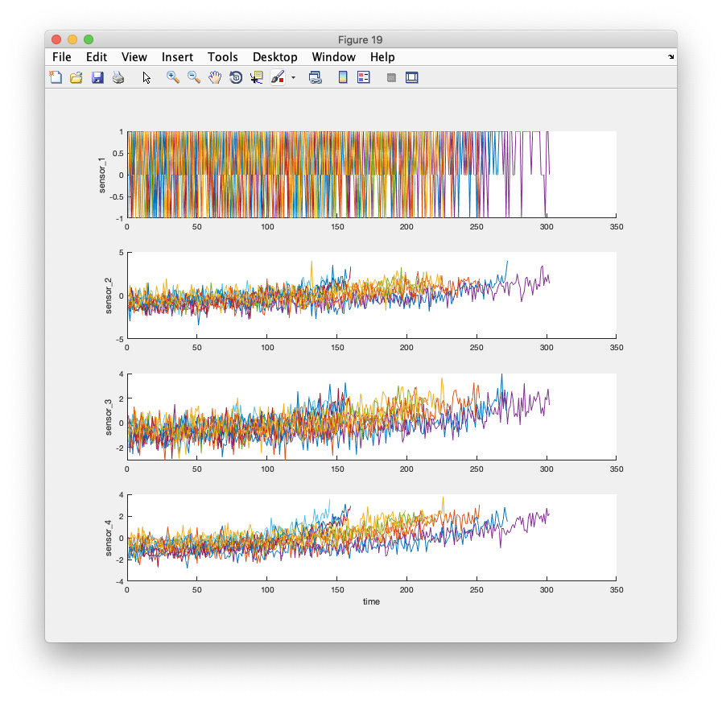
- 정규화 이후 성능 저하 경향이 몇 종류의 센서에서 나타남

### 추세 분석 (Trendability Analysis)

- 트렌드에 맞는 센서계측 데이터를 선택하여 예지를 위한 상태 표시 인자를 구성
- 각 센서 측정에 대해 선형 저하 모델을 추정하고 신호의 기울기를 랭킹
- 8개의 가장 큰 기울기를 가진 신호를 정렬 `sensorTrended =[2, 3, 4, 7, 11, 12, 15, 17]`
- 강한 추세를 보이는 센서 데이터
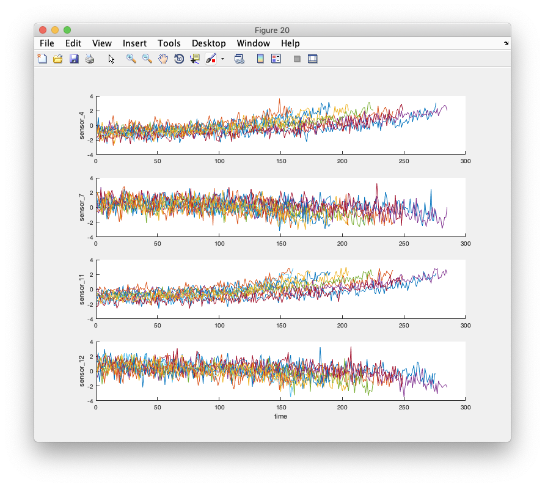

### 상태 표시 인자 구성 (Construct Health Indicator)

- 단일 상태 표시 인자로 부터 유사성 기반 모델 학습
- 모든 Run-to-failure 데이터는 정상 상태에서 시작한다고 가정
- 처음 상태에 값이 1, Failure 상태는 0으로 지정
- 상태는 시간이 지남에 따라 1에서 0으로 선형 감쇠하는 것으로 가정함
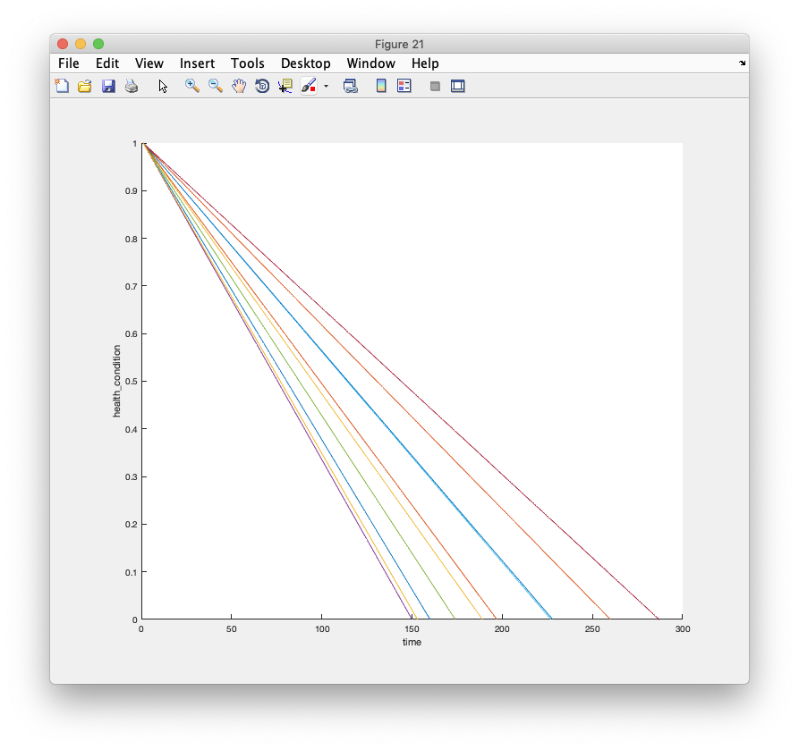
- 여러 센서데이터는 하나의 Health Indicator에 융합됨

### 유효성 검증 데이터에 동일한 작업 적용 (Apply same operation to validation data)

- 검증 데이터 세트를 사용하여 작업 영역 정규화 및 센서 융합 프로세스를 반복
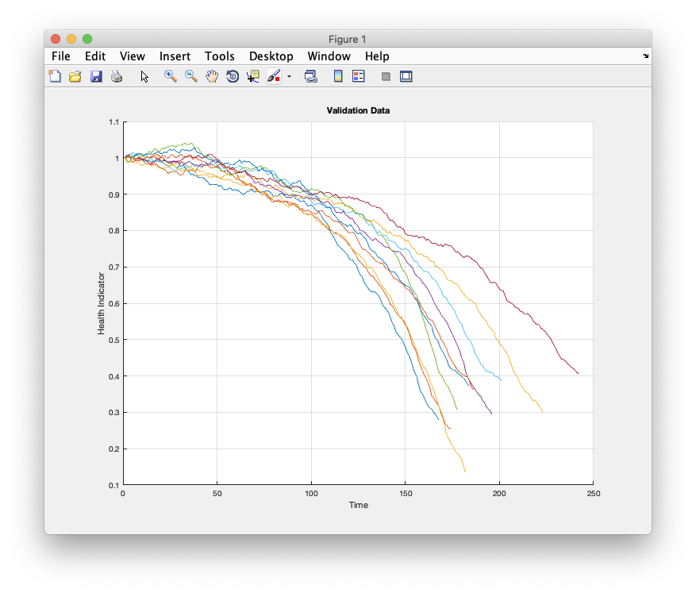

### 유사성 기반 RUL 모델 구축 (Build Similarity RUL Model)

- 학습 데이터를 사용하여 residual 기반 유사성 RUL 모델을 작성
- 이 설정에서 모델은 각 융합 된 데이터를 2차 다항식과 적합
- 데이터와 데이터 사이의 거리는 residual의 1-norm에 의해 계산

> $d(i,j) = ||y_i -\hat{y}_{j,i}||_{1}$

여기서, $y_{j}$는 기계$j$의 Heath indicator, $\hat{y}_{j,i}$는 기계$j$의 2차 다항식 모델을 사용하여 기계$j$의 추정된 Heath indicator 
- 유사성 점수(similarity score)는 다음 식에 따라 계산

> $score(i,j) = exp(-|d(i,j)|)$

- 유효성 확인 데이터 세트에 하나의 앙상블 멤버가 주어지면 모델은 학습 데이터 세트에서 가장 가까운 50개의 앙상블 멤버를 찾고 50개의 앙상블 멤버를 기반으로 확률 분포를 맞추고 분포의 중앙값을 RUL의 추정치로 사용

### 성능 평가

- 유사성 기반 RUL 모델을 평가하려면 샘플 검증 데이터의 50%, 70% 및 90%를 사용하여 RUL을 예측
- 기계의 생애기간의 50% 정도인 첫번째 중단점 전에 유효성 검증 데이터를 사용
- 유효성 검증 데이터를 50% 혹은 nearest neighbors에서 잘라내어 시각화 하면

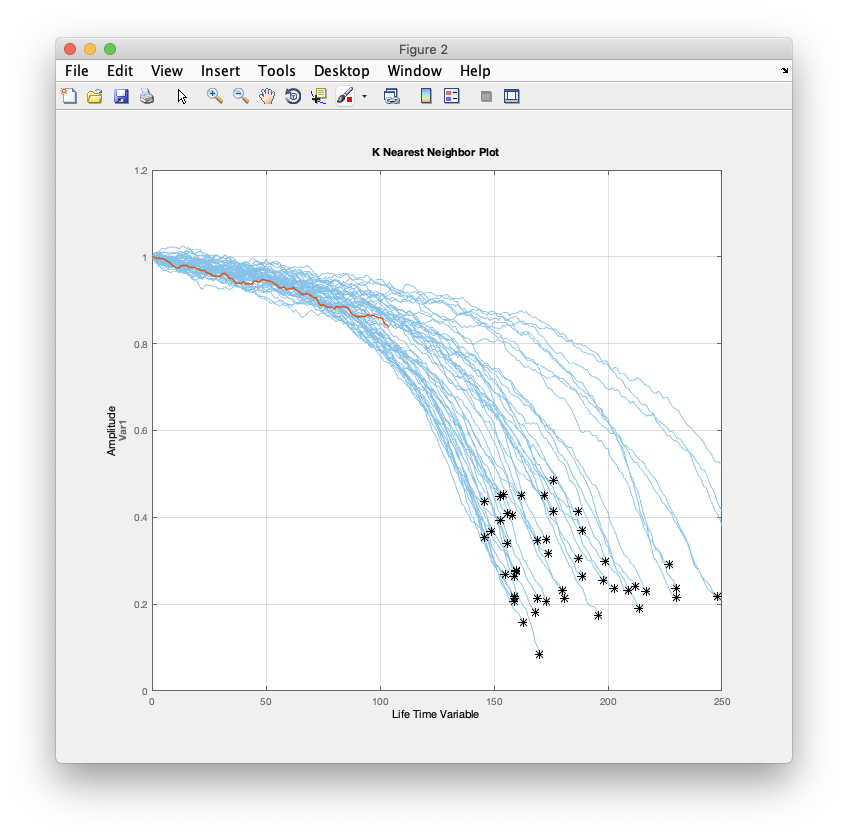

- 실제 RUL 및 추정 RUL의 확률 분포와 비교하여 예상 RUL을 시각화
  


- 기계 상태가 중간 단계에 있을 때 추정 된 RUL과 실제 RUL 사이에는 비교적 큰 오차가 있음
- 가장 유사한 10개의 곡선은 시작 부분에서 가깝지만 failure 상태에 접근 할 때 두 갈래로 갈라져 RUL 분포에서 대략 두 가지 모드가 됨
- 기계의 생애기간의 70%인 두번째 중단점 전에 유효성 검증 데이터를 사용

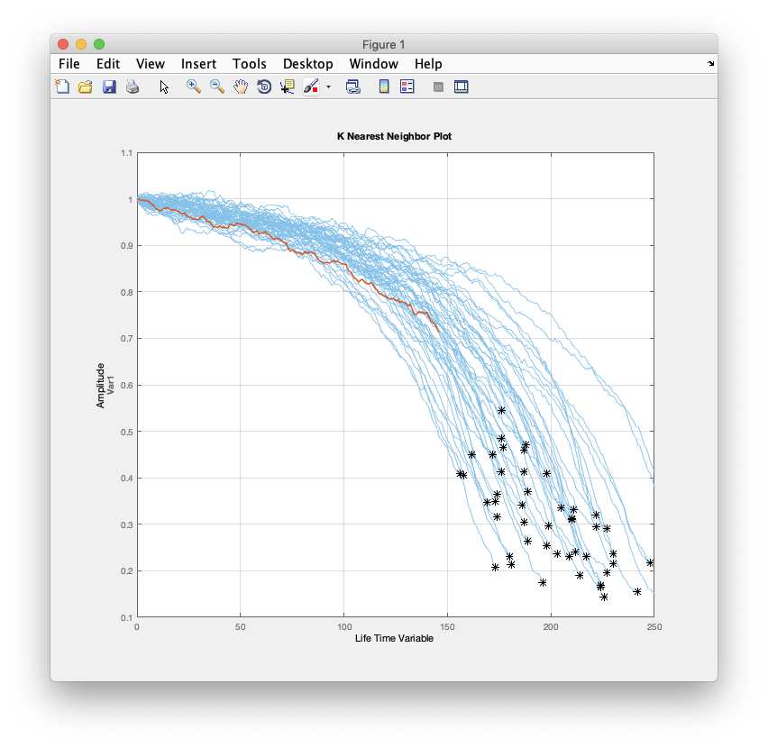
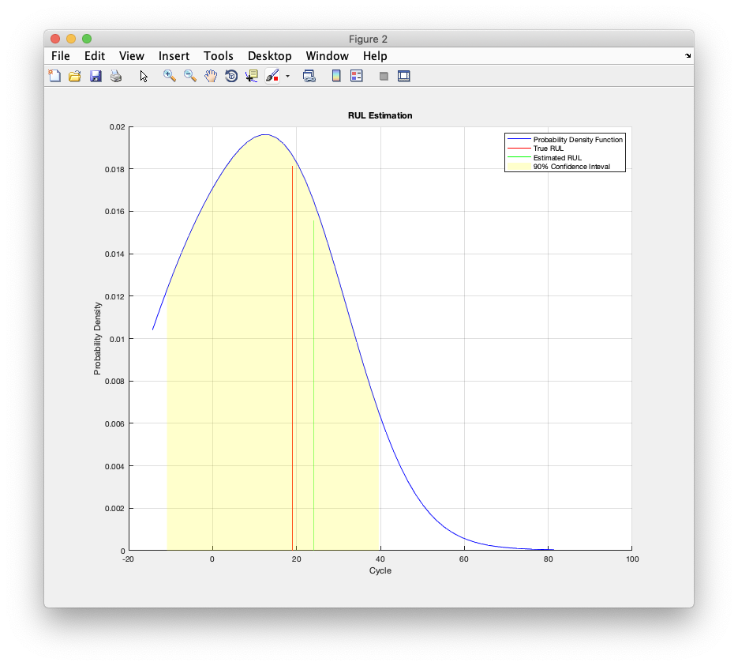

- 더 많은 데이터가 관찰되면 RUL 추정이 향상됨을 확인
- 기계의 생애기간의 90% 인 세번째 중단점 전에 유효성 검증 데이터를 사용
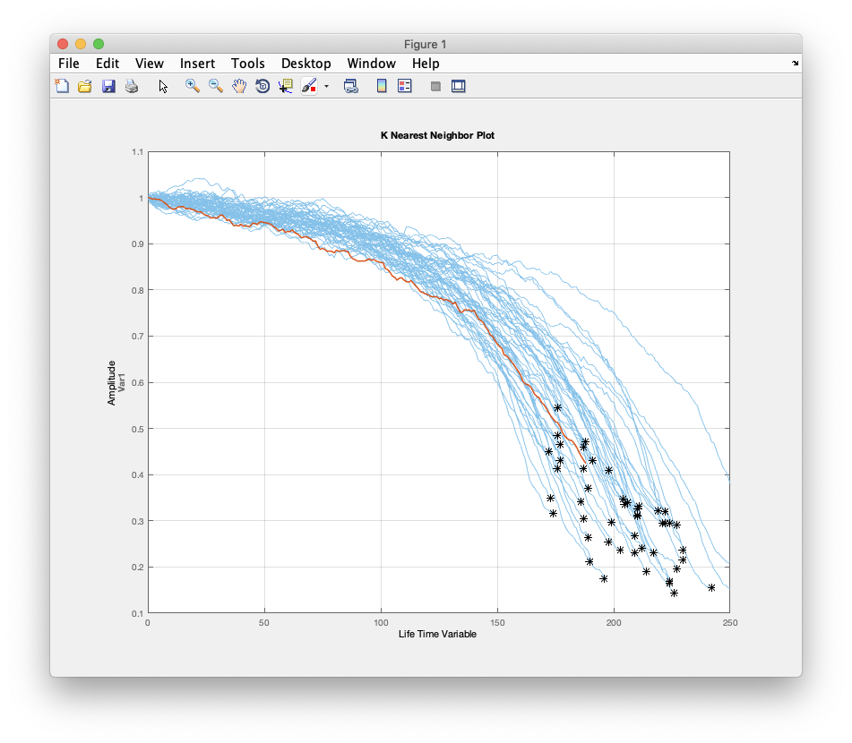


- 기계가 고장에 가까울 때, RUL 추정치가 더욱 향상됨을 확인
- 전체 유효성 검증 데이터 집합에 대해 동일한 평가 절차를 반복하고 각 중단 점에 대해 추정 된 RUL과 true RUL 사이의 오류를 계산
- 확률 분포와 함께 각 중단점에 대한 오류 막대 그래프를 시각화
  
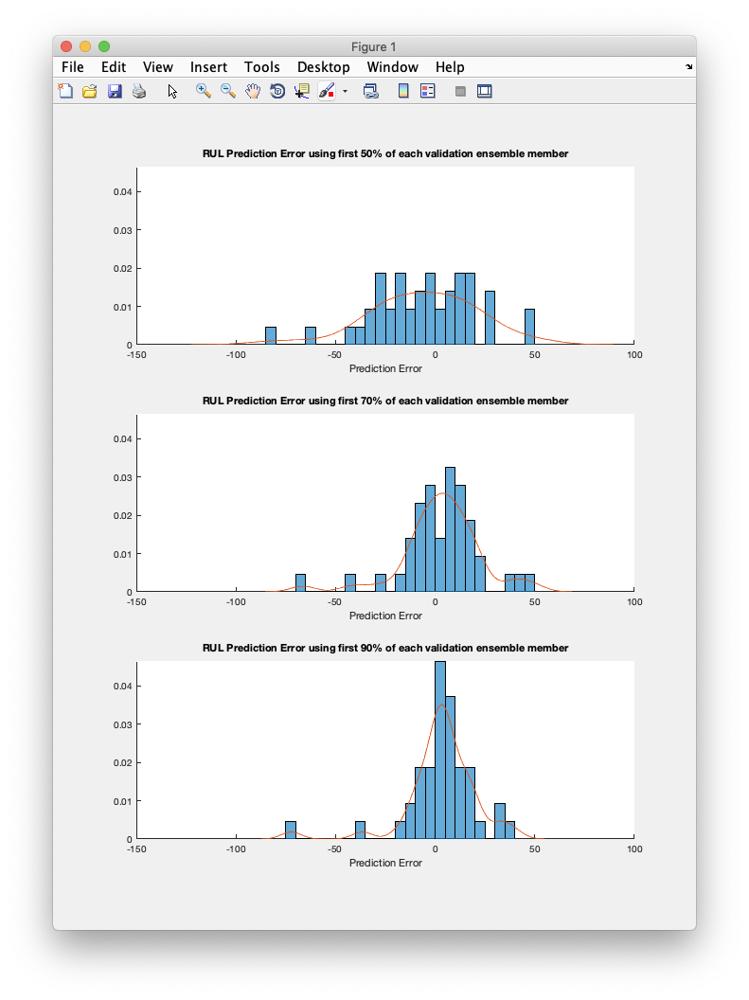
