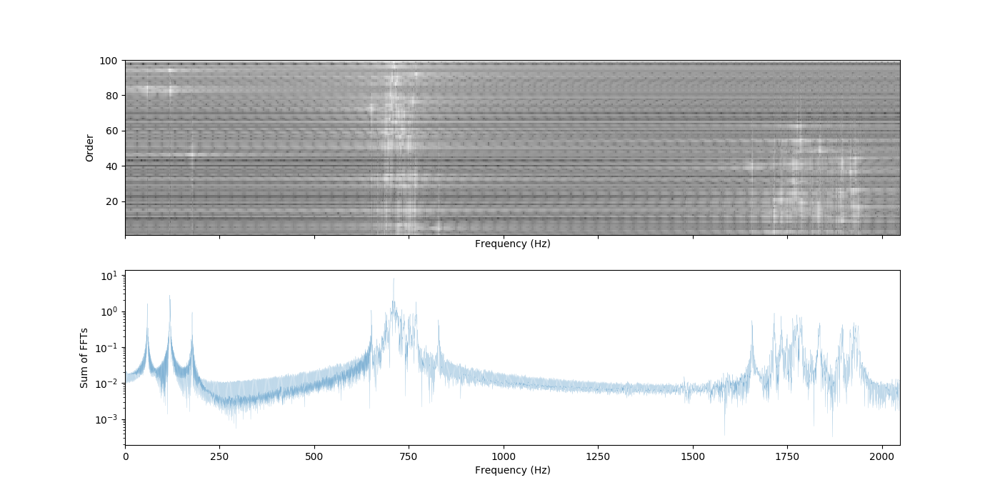

# 개발 보고

## A-PdM 플랫폼

### 용어 정의

- APIv2: DB, Cache, MQTT 연동을 모두 수행하고 데이터를 CLIENT에 표출하기 위한 **백엔드 서버 애플리케이션**. 주로 데이터는 GraphQL과 socket을 이용하여 CLIENT로 내보내며, MQTT 연동을 수행한다. (APIv1은 베어본PC서버 동작하며, 현재는 성능 및 용량 문제로 proxy로만 사용 중)
- CLIENT: APIv2와 연동하여 웹브라우저에 UI렌더링을 수행하는 **프론트 웹애플리케이션**. 서버는 AWS EC2 인스턴스(Ubuntu 18.04)에서 동작하며, Deployment 자동화가 구축되어 있음. Chrome, Firefox, Edge 브라우저와 크로스 체크하며 개발을 진행하고 Internet Explorer는 지원하지 않음.
- CORE: Anomaly, Fault detection, Predictive 분석을 수행하는 **백엔드 서버 애플리케이션**으로 Python과 nodeJS로 동작함. 주로 DB와 Cache에서 데이터를 받아서 분석 후 DB로 저장.
- dev: Developer 모드로 개발과 디버그 및 로그 확인을 위한 모드(주로 개발 API와 서버 API를 분리하여 작업하고, dev 서버 가동을 위한 모드)
- prod: Production 모드로 배포를 진행하기 위한 모드. (주로 minify 작업을 수행하고, deployment를 위한 환경변수를 설정 함)
- component: CLIENT빌드를 위한 핵심인 React 컴포넌트를 말함

### 버전관리

- version: [Semver (semantic versioning)](https://semver.org/) 을 따르며 버저닝을 수행. `v(MAJOR).(MINOR).(PATCH)`
- 버전관리는 git을 이용하고, Github의 Private 저장소에서 Release 버전을 관리, Dev수준의 버전은 백엔드 서버(사내 서버), Deploy를 위한 버전은 프론트엔드 서버(AWS)로 Remote를 관리함.

### 주요 개발 사항

- 별첨: 2019-08-13-APdM-API 문서 (API 및 DB Documentation)

#### v1.1.2-rc2 /2019-08-11

- APIv2: MQTT 포멧 전환으로 `APIv2zadd`, `promisify` 추가 적용
- APIv2: `socket` 적용 데이터 업데이트 체크
- APIv2: 게이트웨이 리스트 `JSON` 변수화, 추후 DB Model로 통합하여 수정
- APIv2: DB연동 모듈 분리 (`controller`, `models`, `scheme`, `data`)
- APIv2: 반복적으로 사용되는 API코드의 라이브러리화 `lib` 폴더로 정리
- CLIENT: (dev, prod) `gulp`를 사용하여 자동 deployment 실행 `dev`, `prod` 구분
- CLIENT: (dev) Webpack 미들웨어(`webpack-dev-middleware`) 설정으로 수정, `broser-sync`, `webpack-hot-middleware` 추가
- CLIENT: (prod) `gulp` 설정에서 `webpack.prod` 설정으로 빌드
- CLIENT: (component) `Dashboard` 컴포넌트 Presenter와 Container 분리
- CLIENT: (component) `Dashboard` `Monitoring` 차트 컴포넌트의 상태관리를 React Hook을 사용, `createContext`, `useConext`로 변경
- CLIENT: (component) API 쿼리를 `react-apollo`의 `Query` 컴포넌트에서 `react-apollo-hooks`의 `useQuery` 컴포넌트를 사용
- CLIENT: (component) 컴포넌트 라이프사이클 관리

## A-PdM Core 분석 모듈

### Anomaly detection

#### v1.0.1 /2019-08-11

- `analysis.js`: `mathjs` 기반 RMS, FFT, Skewness, Kurtosis 분석 적용
- `severity.js`: ISO-10816 severity 모듈 개발 중

### Fault detection

#### v1.1.0 /2019-08-11

- `core.py`: 블록행켈행렬 빌드 `scipy.linalg`로 변경

```python
Hdata=hankel(data[0:2048],data[2048:-1])
```

- `core.py`: 특이치분해, 고유치해석 `scipy.sparse.linalg` 모듈 로 변경

```python
u, s, vt = svds(Hdata, k=nk, tol=1e-10, which='LM', maxiter=100)
```

- `core.py`: 신호처리(스펙트럼), 통계처리 `scipy` 모듈 구성

```python
P1 = np.append(A1[0,:],A1[:,-1])
P = np.hstack((P, P1[:, np.newaxis]))
F, Pxx_den = signal.welch(P1, fs=Fs, window="hamm", nfft=NFFT, detrend='constant')
```

- `core.py`: A-PdM raw데이터 쿼리 모듈 구성

```python
import redis
import json
import time
```

- `core.py`: A-PdM raw데이터 파싱 및 인코딩 처리

```python
client = redis.StrictRedis(
    host='192.168.25.3',
    port=6379,
    password='...')
data_list = client.zrange(
    "gateway/96:64:61:B7:EA:2E/00124B000FAE8F51",
    -256,
    -1, desc=False, withscores=True)
json_array = []
for item in data_list:
    json_data = json.loads(item[0].decode('utf8'))
    json_array.append(json_data)

sorted_json = sorted(
    json_array,
    key=lambda k: k['Index'],
    reverse=False)
data = []
for item in sorted_json:
    data = data + item["Data"]
```

- `core.py`: A-PdM에서 데이터를 쿼리하여 분석 데이터 표출 구성

```python
Nyfreq = freq[:int(NFFT / 2 - 1)]
extent = [Nyfreq[0], Nyfreq[-1], 0, nk-1]
feature = np.log10(np.abs(
    Pfft[:int(NFFT / 2 - 1), :]).transpose())
feature = np.delete(feature, 0, axis=0)
```

- Deep analyzed feature
  

- Fast analyzed feature
  

- `matplotlib.pyplot` 으로 시각화
  

### Predictive analysis

#### Predictive 모듈 개발을 위한 데이터 준비

- PHM2008 학회 데이터 첼린지 데이터셋을 사용 [https://ti.arc.nasa.gov/tech/dash/groups/pcoe/prognostic-data-repository/](https://ti.arc.nasa.gov/tech/dash/groups/pcoe/prognostic-data-repository/)
- 218개의 Run-to-failure의 데이터가 있음 (앙상블 데이터: 다변수 시계열 데이터)
- 각 시계열 데이터는 각각 다른 엔진에서 계측한 것이지만, 동일 기종의 엔진으로 구성
- 각 엔진은 알려지지 않은 초기 마모 및 제조 편자가 있음 -> 결함 조건은 아님
- 각각의 앙상블마다 26개의 컬럼의 데이터가 있음

| column | contents              |
| ------ | --------------------- |
| 1      | unit number           |
| 2      | time, in cycles       |
| 3      | operational setting 1 |
| 4      | operational setting 2 |
| 5      | operational setting 3 |
| 6      | sensor measurement 1  |
| 7      | sensor measurement 2  |
| ...    | ...                   |
| 26     | sensor measurement 26 |

- 엔진 성능에 상당한 영향을 주는 세가지의 작동 설정이 있고 이러한 설정이 데이터에 포함되어 있음
- 엔진은 데이터 초기 시작부분에서는 정상적으로 작동하고 일부 지점에서 성능이 저하되기 시작하여 엔진 가동하기 적절하지 않은 상태까지의 데이터를 포함함

## 게이트웨이 애플리케이션

### 스마트 게이트웨이 애플리케이션

#### v1.2.1 /2019-08-11

- (prod) `childProcess` 라이프사이클 개선 : zombie 프로세스화 방지
- (prod) 데이터 수집후 re-arrange하여 4096개의 데이터가 모두 담긴 패킷으로 MQTT v2 연동으로 수정
- (prod) 설치, deployment 자동화 `shelljs`
- (div) SSH 터널 자동화 스크립트 `shelljs`
- (dev) `typescript` fail 방지
- (dev) 로그파일 모니터링 `shelljs` 사용 간편화
- (dev) binary 프로세스 log 모니터링과 애플리케이션 모니터링 동시에 모니터링 가능
- (dev) `UnhandledPromiseRejectionWarning` 경고 해결

### MCDL 개발 사항

#### `ads1274` 모듈

- `voltageOut(dataArray, [callback])`
- `gravityOut(dataArray, [callback])`
- `jsonRMSData(dataArray, [callback])`
- `jsonRawData(dataArray, [callback])` : nodeJS의 UDP지원 네이티브 모듈인 `net` 모듈은 `ads1274` 1초에 10.5k번 전송하는 성능에 데이터를 많이 놓침 -> IPC(shm) 모듈을 사용하여 개선예정

#### IPC `shm` 모듈

- 테스트 진행 중
- `shm-typed-array` 모듈 적용
- 지원 타입

```JSON
shm.BufferType = {
  'Buffer': shm.SHMBT_BUFFER,
  'Int8Array': shm.SHMBT_INT8,
  'Uint8Array': shm.SHMBT_UINT8,
  'Uint8ClampedArray': shm.SHMBT_UINT8CLAMPED,
  'Int16Array': shm.SHMBT_INT16,
  'Uint16Array': shm.SHMBT_UINT16,
  'Int32Array': shm.SHMBT_INT32,
  'Uint32Array': shm.SHMBT_UINT32,
  'Float32Array': shm.SHMBT_FLOAT32,
  'Float64Array': shm.SHMBT_FLOAT64,
};
```

#### MQTT 모듈

- JSON 데이터 모델 압축지원 : [CBOR](https://cbor.io/) (RFC 7049)
- nodeJS [`cbor`](https://www.npmjs.com/package/cbor) 모듈 사용 : 유엔젤 혹은 SKT Decoding 여부 확인
- 압축 시 Data rate 체크
- 테스트 진행 중

#### Firmware 자동 업데이트

- `git`을 기반으로 원격 서버 접근이 가능한지 상태 확인 후 모듈 업그레이드

```javascript
const exec = require("child_process").execSync;
ㅍ;
exec("npm install");
const isReachable = require("is-reachable");

setInterval(function() {
  try {
    isReachable("pdm.aproskorea.com").then(reachable => {
      require("simple-git")(__dirname)
        .then(function() {
          // console.log('Starting Pull...');
        })
        .pull("origin", "master", function(err, update) {
          if (update && update.summary.changes) {
            console.log("Updating changes...");
          }
        })
        .then(function() {
          exec("npm install");
        });
    });
  } catch (error) {
    console.log(error);
  }
}, 5000);
```

- MCDL 게이트웨이 시스템 서비스 등록

```bash
#!/bin/bash

### BEGIN INIT INFO
# Provides:          MCDL_v1
# Required-Start:    $local_fs $network
# Required-Stop:     $local_fs
# Default-Start:     2 3 4 5
# Default-Stop:      0 1 6
# Short-Description: mcdlautoupgrade
# Description:       APROS MCDL Auto Upgrade
### END INIT INFO
export PATH=$PATH:/usr/bin
export NODE_PATH=$NODE_PATH:/usr/lib/node_modules

case "$1" in
  start)
    echo "Delete logfile"
    rm /root/.forever/upgrade.log
    echo "Starting upgrade service"
    (cd /root/mcdl/ && forever start --uid upgrade -a \\
    --killSignal=SIGTERM \\
    -c nodemon upgrade.js \\
    --exitcrash);;
  stop)
    echo "Stopping upgrade service"
    (forever stop /root/mcdl/upgrade.js);;
  *)
    echo "Usage: /etc/init.d/upgrade {start|stop}"
    exit 1
    ;;
esac

exit 0
```

- 서버 `git` 저장소 선정 필요 (Github, APdM 서버)
- `git` 스크립트 방식 OTA 고려 중
